使用 flutter 实现的 《玩Android》客户端

### 功能效果图
| --- | --- | --- |
| 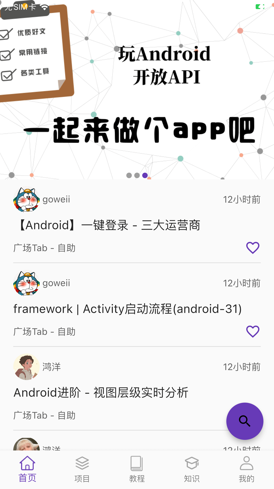
| 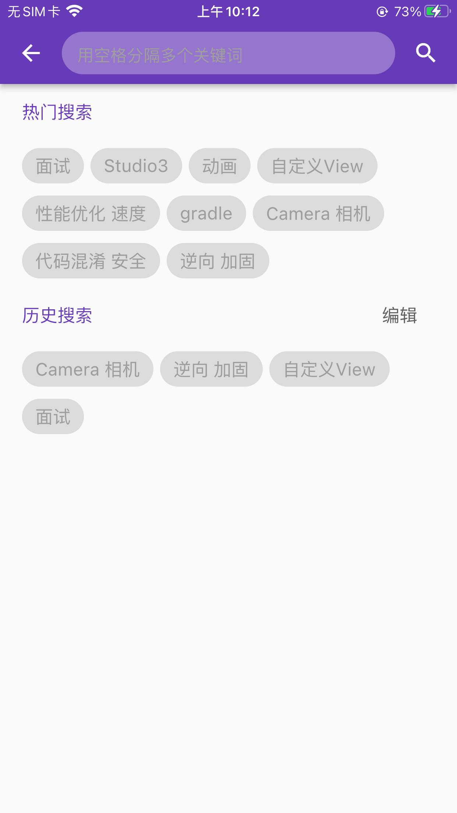
| 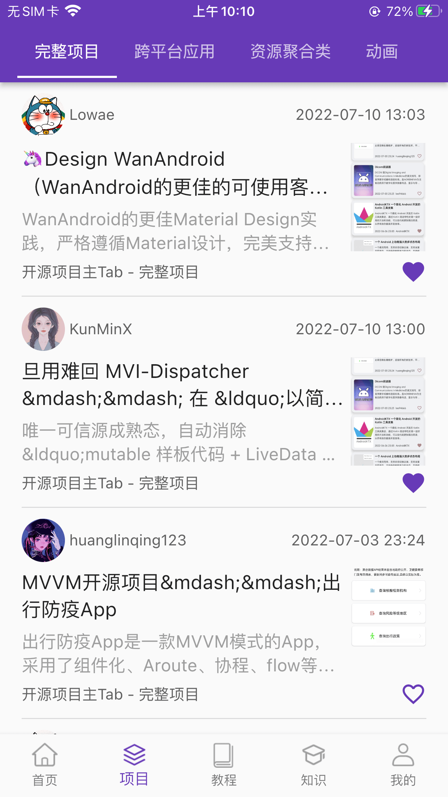
|
| 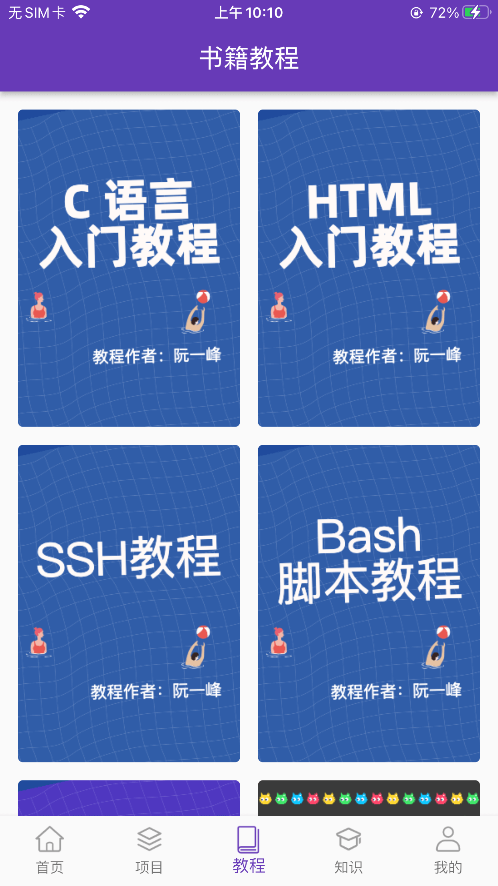
| 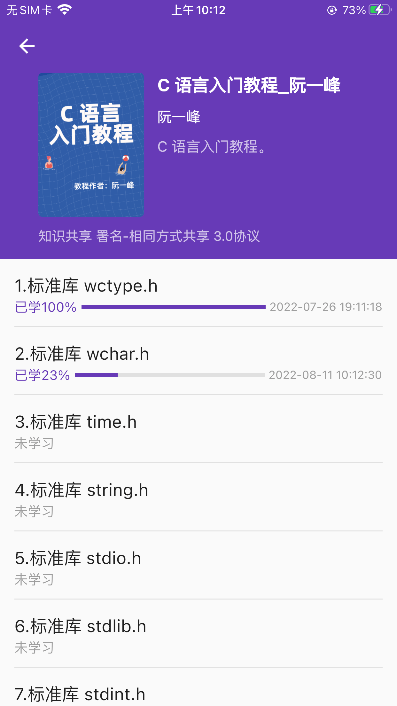
| 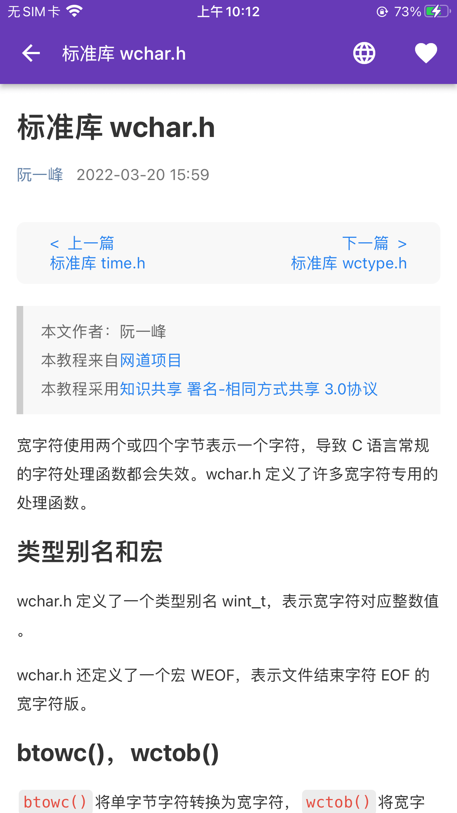
|
| 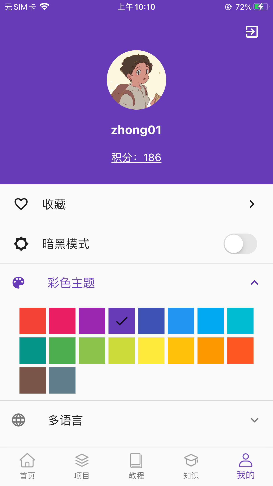
| 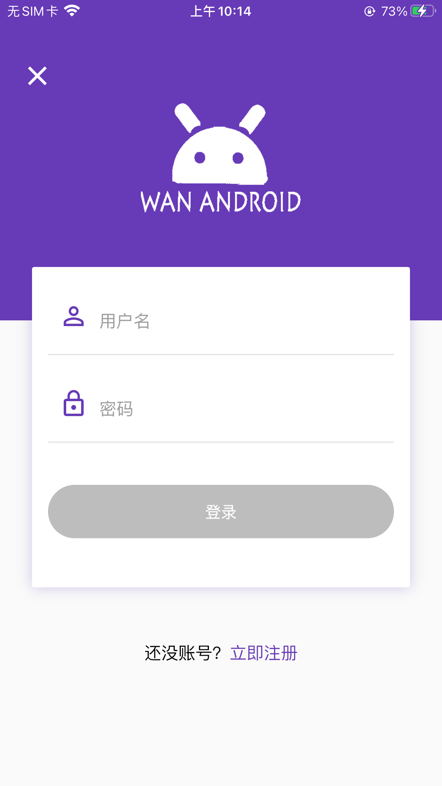
| 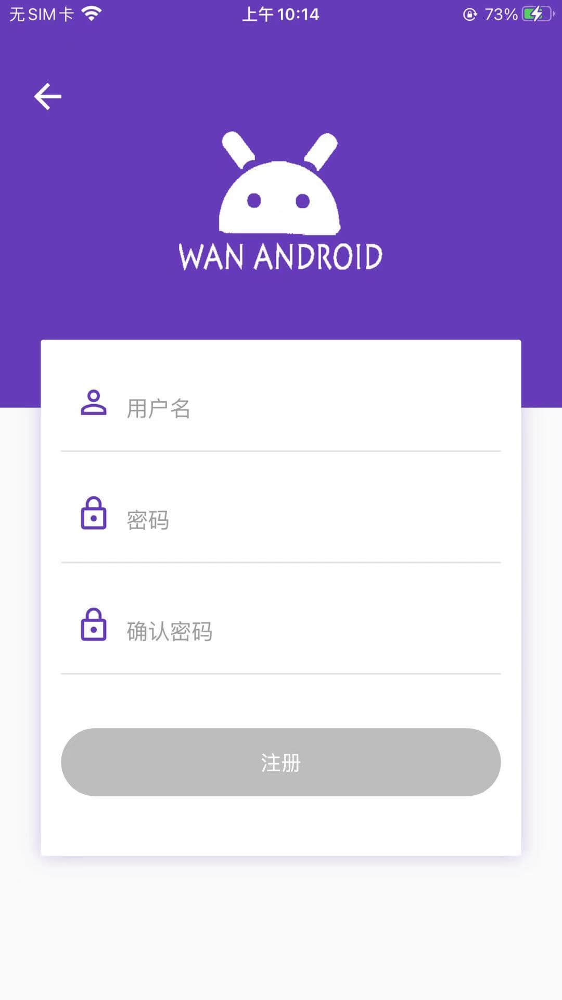
|
| 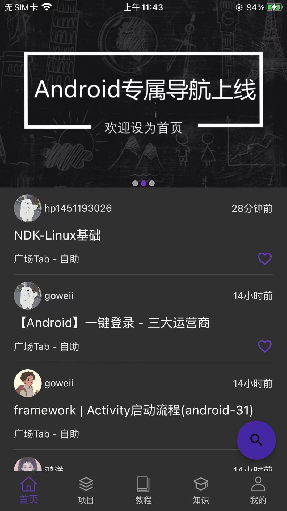
| 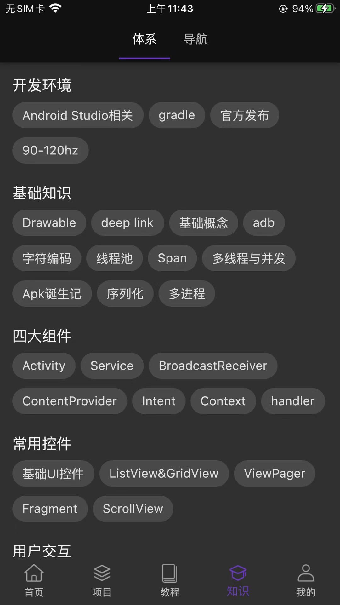
| 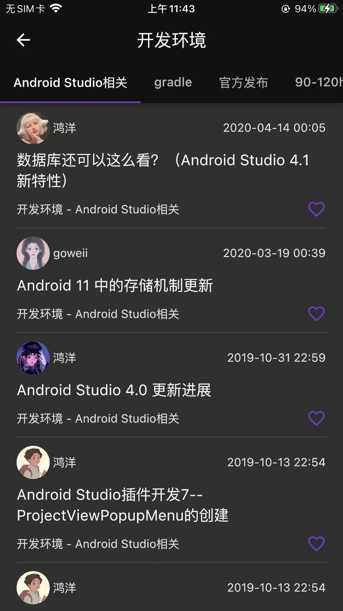
|

### 项目结构
```
 |--lib
    |-- base (基类)
    |-- common (常用类，例如常量)
    |-- config (配置信息)
    |-- core (核心代码，例如：网络)
    |-- helper (功能辅助类)
    |-- I10n (国际化文本)
    |-- modules (业务模块：账户模块，文章模块，搜索模块，收藏模块,,,)
    |-- utils (工具类)
    |-- widget (全局通用控件)
```

### 业务模块结构
```
|--modules
    |-- article (文章模块)
    |-- search (搜索模块)
    |-- collect (收藏模块)
    |-- ...... (其他模块)
    |-- account (账户模块)
        |-- model (数据管理model，实体类entity)
              |-- account_model (登录，注册，本地数据)
              |-- user_entity 
        |-- view 
              |-- login_page 
              |-- register_page
        |-- view_model
              |-- login_view_model 
              |-- register_view_model 
```


### 项目简介

大体上通过业务模块分包，使用 MVVM （基于 Provider ）模式架构，目标是构建一个扩展性良好的应用，View 模块编写 widget 相关的布局信息，界面业务逻辑在 ViewModel 中实现，数据通过 Model 管理。


### 技术概览

- dio ： 网络数据请求
- sqflite ： 本地数据库管理
- shared_preferences ： 本地配置信息管理
- path_provider ： 文件读写（存储路径）
- cached_network_image ： 网络图片加载/缓存
- fluttertoast ： Toast
- flutter_inappwebview ： WebView
- provider ： 数据共享/状态管理
- flutter_html ： html文本展示
- cookie_jar/dio_cookie_manager ： 网络请求cookie管理
- intl ： 国际化
- flutter_lifecycle_aware ： 生命周期管理
- easy_refresh ： 下拉刷新/上拉加载
- FlutterJsonBeanFactory ： json 转 实体类(androidStudio插件)
- Flutter Intl ： 多语言（androidStudio插件）


### 附加产物

开发过程中发现 flutter 生命周期存在使用使用上的不足，封装了一个生命周期相关的库 [flutter_lifecycle](https://github.com/RuffianZhong/flutter_lifecycle)

flutter_lifecycle 可以使任何对象具备生命周期感知能力，结合网络请求，实现根据生命周期自动取消网络请求


### 后续

逐步完善一个复杂项目可能用到的技术（例如：组件化）或者 flutter 相关的技术（编写一系列demo展示控件使用，动画使用，自定义控件，等等）


### 鸣谢

项目数据接口来自 [玩Android](https://www.wanandroid.com/) 


